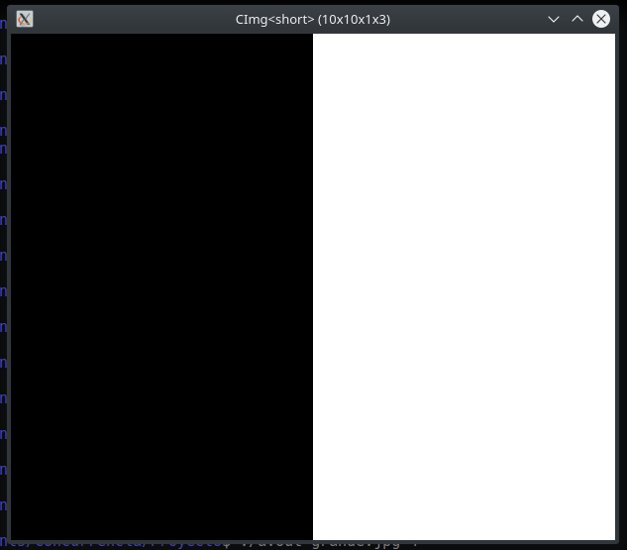
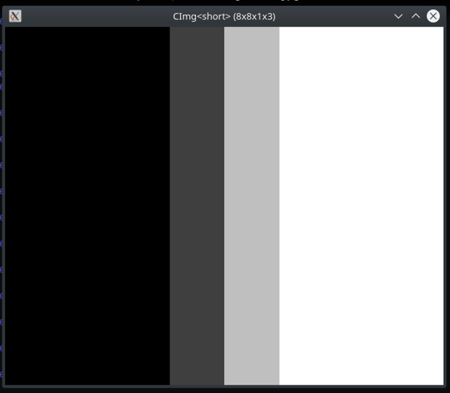
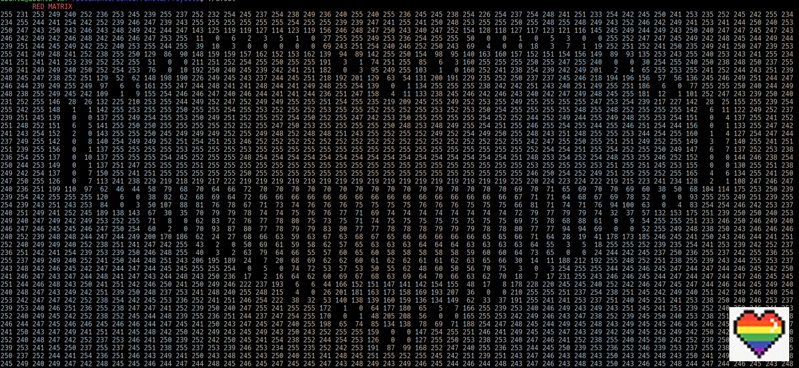
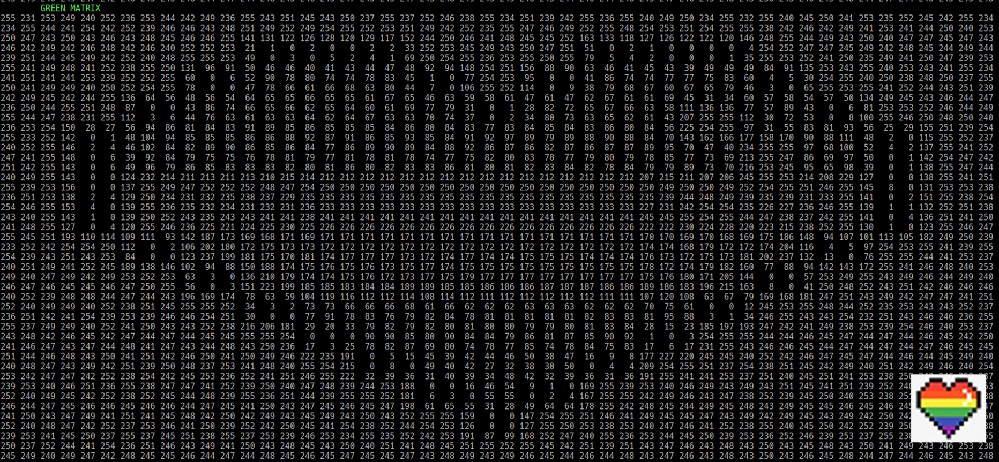
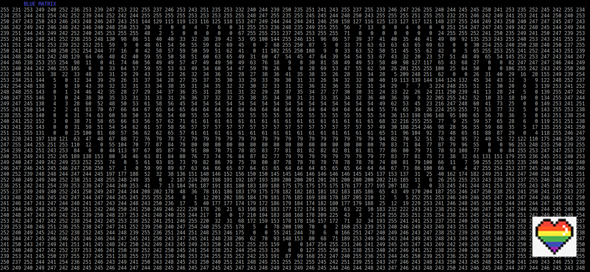
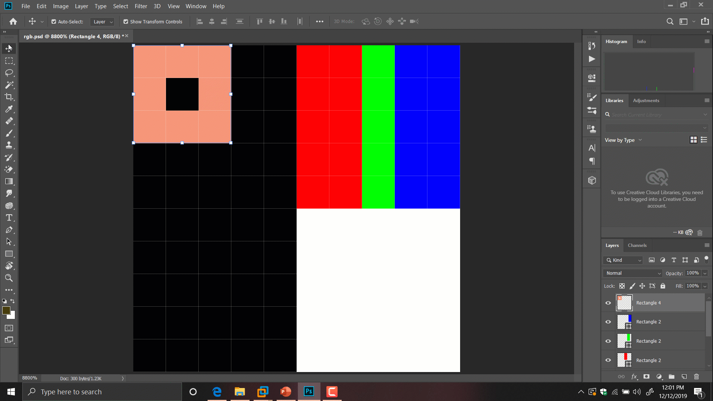

# FILTRO DE IMAGENES

El siguiente proyecto prueba el algoritmo para aplicar filtros a imagenes por medio de la convolucion

---

## Que es un filtro

Es la alteracion digital de una fotografia.

## Filtro de desenfoque

Existen varios tipos, pero todos consisten en suavizar los bordes de los objetos dentro de una imagen




> Para mas informacion [ver referencia](https://www.youtube.com/watch?v=ySbmdeqR0-4)

---

## Libreria [CImg](http://cimg.eu/)

Es una libreria que ofrece utilizades para el procesamiento de imagenes, la libreria es capaz de leer/escribir imagenes y aplicar filtros en ella. La libreria perse es capaz utiliza paralelizmo com lpthreads, pero para mi implementacion solo la utilice para leer los datos de una imagen.

## Lectura de una imagen

Las imagenes, son interpretadas como matrices, donde cada posicion de la matriz tiene un valor del 0-255. Y existe una matriz para cada uno los canales RGB (jpg/jpeg). Para una imagen en formato PNG utiliza 4 canales (RGBA).

#### Cimg crea un arreglo donde las primeras posiciones son los datos del color R, luego todos los G y por ultimo los B. i.e. char* imagen = {R, R, R, G, G, G, B, B, B}

> Explicacion de como CImg maneja los pixeles [aqui](http://cimg.eu/reference/group__cimg__storage.html)

---

## Ejemplo de lectura de imagen con CImg

Dada la siguiente imagen:


---

CImg nos dara los siguientes datos:

Rojos



---

Verdes



---

Azules



> Notese que los negros son valores bajos (o nulos) y los blancos son los 3 canales de colores en sus valores mas altos

---

## Resultado del filtro


---

## Implementacion

### Se crearon 2 funciones principales

La siguiente funcion utiliza 2 _for loops_ para mover el kernel en toda la superficie de la imagen y luego escribe en la matriz **result**, la cual tiene los datos de la imagen con el filtro ya aplicado
```cpp
template <size_t N>
void convolution(const short* ptr, const array<short, KERNEL_SIZE>& kernel, array<short, N>& result) {
    ushort x_moves = IMG_SIZX - KERNEL_X + 1;
    ushort y_moves = IMG_SIZY - KERNEL_Y + 1;

    double start, finish;
    GET_TIME(start);
    #pragma omp parallel for num_threads(thread_count) schedule(static, 2)
    for (ushort i=0; i < y_moves; i++) {
        for (ushort v=0; v < x_moves; v++) {
            result[i*x_moves + v] = kernel_calc(ptr, i, v, kernel);
        }
    }
    GET_TIME(finish);
    total_time += finish-start;
}
```

---

La siguiente funcion hara los calculos de los datos del kernel con _cierta parte de la imagen_ y devolveviendo el resultado de los calculos

```cpp
short kernel_calc(const short* ptr, short x_offset, short y_offset, const array<short, KERNEL_SIZE>& kernel) {
    ushort total_sum = 0;
    ushort row_sum;
    for (ushort i=0; i < KERNEL_X; i++) {
        row_sum = 0;
        for (ushort v=0; v < KERNEL_Y; v++) {
            row_sum += kernel[v*3 + i] *  ptr[(i+x_offset)*IMG_SIZX + (v+y_offset)];//operacion es columna x fila
        }
        total_sum += row_sum;
    }
    return total_sum / KERNEL_TOTAL;
}
```

---

## PERO QUE ES ESO DEL KERNEL !?

El kernel es una pequena matriz (usualmente de 3x3 o 5x5) que recorre toda la imagen para aplicar los calculos sobre un pixel pero tomando en cuenta los pixeles adyacentes.



---

## Ejemplos de kernels

### Deteccion de bordes:

```cpp
const array<short, 9> kernel = { 0, -1,  0,
                                -1,  5, -1,
                                 0, -1,  0 };
```

### Desenfoque:

```cpp
const array<short, 9> kernel = {1, 2, 1,
                                2, 4, 2,
                                1, 2, 1 };
```

---

## Paralelizacion

Uno de los objetivos principales era resolver el problema y aplicar paralelizacion a este para probar que podia ser mas rapido (o mas lento) que una implementacion en secuencial. La implementacion fue con [OpenMP](https://www.openmp.org/wp-content/uploads/OpenMP4.0.0.pdf) y se probaron diversas configuraciones con los threads.

 #### Los resultados promedio fueron los siguientes (100 imagenes 1080x720):

|             |(static, 2) con 4 threads| Secuencial | (dynamic, 1) con 4 threads | (static, 1) con 2 threads |
|:-----------:|:-----------------------:|:----------:|:--------------------------:|:-------------------------:|
| Tiempo(seg) |       0.13470515        | 0.22241637 |        0.16348029          |        0.21238093         |

---

## Compilacion y Ejecucion (linux)

Si deseas ejecutar la aplicacion en tu computadora debes:

- Descargar el repositorio
- Compilar con _./compile.sh_
- Crear una carpeta _output_ (porque el programa guarda las imagenes filtradas en ese folder, y si no existe dara error)
- Correr _./run_tests_ (tambien crea un archivo _times.txt_ que guarda cuanto tiempo tardo el algoritmo, **no mide todo el programa, solo el algoritmo**)
- **Ya puedes ver las imagenes filtradas en la carpeta _output_!**
